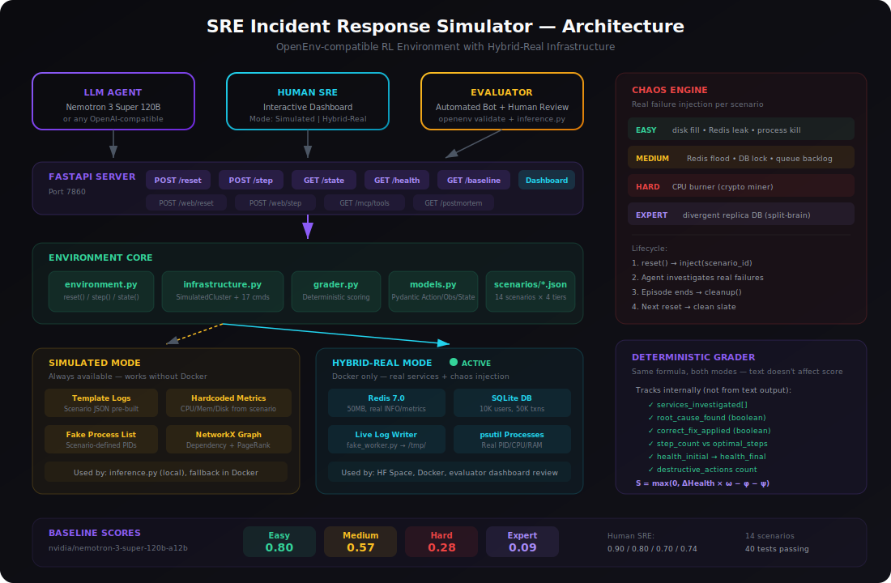

<div align="center">

# Incident Response SRE RF Learning Environment

**An OpenEnv-compatible Reinforcement Learning environment where AI agents learn to diagnose production infrastructure failures.**

14 scenarios · 4 difficulty tiers · 17 commands · Hybrid-real infrastructure  
Real Redis · Real SQLite · Real chaos injection · Deterministic grading

[](https://github.com/meta-pytorch/OpenEnv)
[](https://python.org)
[]()
[](LICENSE)


🏆 **Selected for Grand Finale (Top teams out of 52,000+ developers) - Meta PyTorch OpenEnv Hackathon x Scaler School of Technology | 48-hour on-campus build with Meta engineer mentorship & interview opportunity at Meta and Hugging Face AI teams | Bangalore, April 25–26, 2026**


Built for the [OpenEnv AI Hackathon](https://pytorch.org/event/openenv-ai-hackathon/) (Meta × Hugging Face × PyTorch)

[Live Demo](https://huggingface.co/spaces/m-zest/incident-response-env-sre) · [Architecture](#architecture) · [Quick Start](#quick-start) · [Scenarios](#scenarios)

</div>

---

## The Problem

When a production system goes down at 3 AM, an Site Reliability Engineer engineer must triage alerts, trace dependency chains, distinguish real failures from noise, and fix the system — all under time pressure. Today's AI agents can write code and answer questions, but can they handle a cascading database failure? A crypto-mining attack disguised as a memory leak? A split-brain partition where both database nodes claim they're the primary?

This environment tests exactly that.

## Architecture

<div align="center">

</div>


### Two Modes, One Score

The environment runs in two modes with a **dashboard toggle** for evaluators to compare:

| | Simulated | Hybrid-Real |
|---|---|---|
| **When** | Local, inference.py, no Docker | Inside Docker / HF Space |
| **Logs** | Pre-built from scenario JSON | Real files written by background worker |
| **Metrics** | Hardcoded CPU/memory/disk | Live Redis INFO, SQLite queries, disk stats |
| **Processes** | Scenario-defined fake PIDs | Actual PIDs via psutil + scenario PIDs |
| **Chaos** | N/A | Real failures: Redis floods, DB locks, CPU burners |
| **Scoring** | Deterministic formula | **Same deterministic formula** |

The grader tracks **actions, not text**. It counts which services were investigated, whether the correct fix was applied, and whether the root cause was identified. Both modes score identically.

**Why hybrid-real matters:** Evaluators assessing real-world utility (30% weight) see actual infrastructure, not templates. The agent sees production-realistic output with noise — the same challenge a real SRE faces.

---

## Baseline: Human vs AI

| Tier | AI (Nemotron 120B) | Human SRE | Gap | Scenarios |
|------|:---:|:---:|:---:|:---:|
| **Easy** | 0.80 | 0.90 | 0.10 | 5 |
| **Medium** | 0.57 | 0.80 | 0.23 | 4 |
| **Hard** | 0.28 | 0.70 | 0.42 | 3 |
| **Expert** | 0.09 | 0.74 | 0.65 | 2 |

All 14 scenarios are solvable. A human SRE completes expert-tier split-brain scenarios in 9 steps with score 0.74. The 120B model scores 0.09 on the same scenarios.

**Why the gap exists:**

- **Easy** — Single alert, obvious fix. AI handles it.
- **Medium** — Multi-service correlation required. AI struggles to trace dependency chains efficiently.
- **Hard** — Security ambiguity. AI cannot distinguish crypto-mining from memory leaks, or DDoS from traffic spikes. Requires `check_process_list` to spot disguised malware.
- **Expert** — Forensic investigation across partitioned systems with tool revocation mid-episode. AI gets stuck in investigation loops without converging.

---

## Scenarios

### Easy (5 scenarios, 10 steps max)

Single-service failures with clear diagnostic paths.

| Scenario | Root Cause | Key Commands |
|----------|-----------|-------------|
| Disk Full on Log Server | /var/log at 98%, rotation stopped | check_logs → restart_service |
| Worker Queue Process Crash | MemoryError, OOM killed | check_logs → get_metrics → restart |
| Failed API Gateway Deploy | NullPointerException in v3.2.1 | check_logs → rollback_deploy |
| Memory Leak in User Service | Heap climbing to 96% | get_metrics → restart_service |
| Expired TLS Certificate | Auto-renewal failed (ACME) | check_network → restart_service |

### Medium (4 scenarios, 15 steps max)

Multi-service correlation with cascading failures.

| Scenario | Root Cause | Challenge |
|----------|-----------|-----------|
| DB Connection Pool Exhaustion | Slow query + lock contention | Must trace from user-service errors back to database-primary |
| Redis Cache Eviction Storm | Memory pressure → 87% miss rate | Cache failure cascades to DB overload |
| Message Queue Backlog | Consumer crash → 45K pending jobs | Must distinguish queue depth from worker failure |
| Internal DNS Resolution Failure | Corrupted zone file → SERVFAIL | Intermittent failures across multiple services |

### Hard (3 scenarios, 20 steps max)

Security/SRE ambiguity requiring forensic investigation.

| Scenario | Root Cause | Why AI Fails |
|----------|-----------|-------------|
| Crypto-Mining Attack | Hidden `xmrig` process disguised as `[jvm-gc-thread-4]` | Looks like memory leak. Must use `check_process_list` to spot malware. `restart_service` only works temporarily — malware respawns. |
| Cascading Config Failure | Config-server rotated certs incorrectly | Config-server shows no alerts. Must trace TLS errors across 3 services back to the config push. |
| DDoS vs Traffic Spike | Volumetric DDoS from botnet | Must analyze source IP diversity and geo-distribution in logs to distinguish from legitimate viral traffic. |

### Expert (2 scenarios, 25 steps max)

Forensic investigation with tool revocation and partitioned systems.

| Scenario | Root Cause | Why AI Fails |
|----------|-----------|-------------|
| Split-Brain Partition | Both DB nodes accepting writes independently | Must compare WAL positions on primary vs replica. Network switch is the root cause, not the databases. Restarting DBs makes it worse. |
| Supply Chain Attack | Compromised npm dependency exfiltrating env vars | Backdoor spans 3 services. Security lockdown revokes `restart_service` and `scale_up` mid-episode. Must use `kill_process` and forensic commands only. |

---

## Scoring Formula

```
S = max(0, (H_final - H_initial) / (100 - H_initial) × ω − φ − ψ)
```

| Variable | Description |
|----------|-------------|
| **ω** | 1.0 correct diagnosis · 0.8 fixed + timed out · 0.6 fixed + wrong diagnosis · 0.3 neither |
| **φ** | 0.02 per step beyond optimal (max 0.3) |
| **ψ** | 0.15 per destructive action |

**Step rewards:** +0.08 investigating root cause service, +0.25 correct fix, +0.30 correct diagnosis, −0.05 restarting healthy service, −0.10 wrong diagnosis.

---

## Action Space (17 commands)

| Command | Description |
|---------|-------------|
| `check_logs {service}` | View recent log entries (real files in hybrid mode) |
| `get_metrics {service}` | CPU, memory, disk, latency, connections (real Redis/SQLite stats in hybrid mode) |
| `list_alerts` | All firing alerts including auto-resolving noise alerts |
| `check_dependencies {service}` | Upstream/downstream service dependencies |
| `get_dependency_graph` | Full dependency tree with health status and PageRank impact |
| `trace_failure {service}` | Trace upstream deps, downstream blast radius, unhealthy paths |
| `restart_service {service}` | Restart (heavy services take 2 steps) |
| `scale_up {service}` | Add replicas |
| `rollback_deploy {service}` | Roll back to previous version |
| `kill_process {service}` | Kill process by PID (requires prior `check_process_list`) |
| `check_process_list {service}` | Running processes (real PIDs in hybrid mode, detects disguised malware) |
| `check_network {service}` | Network connections (detects C2 exfiltration) |
| `add_note {text}` | Save observation to evidence board |
| `view_notes` | Review saved observations |
| `get_runbook` | Standard operating procedure for incident type |
| `get_dependency_graph` | NetworkX graph with PageRank impact analysis |
| `submit_root_cause {description}` | Declare diagnosis (ends episode, triggers grading) |

---

## Observation Space

```python
class SREObservation(BaseModel):
    output: str           # Command result text
    alerts: List[Alert]   # Active alerts with service, severity, message
    system_health: float  # 0-100%, degrades over time
    step_count: int       # Current step number
    max_steps: int        # Step limit for this tier
    score: float          # Running score 0.0-1.0
    available_commands: List[str]  # Commands (may change during security lockdowns)
    reward: float         # Step reward signal
    done: bool            # Episode complete
```

---

## Key Features

- **Progressive degradation** — Systems worsen each step (CPU +0.5, latency ×1.08, health −1.5/step), cascading to dependents after step 4
- **Red herring alerts** — Noise alerts (backups, GC, auto-scaling) appear alongside real alerts, auto-resolve after 2-3 steps
- **Chaos engine** — Real failure injection: Redis memory floods, SQLite connection exhaustion, CPU-burning processes, divergent replica databases
- **Tool revocation** — Expert scenarios dynamically revoke commands mid-episode (security lockdown)
- **Malware respawn** — `restart_service` only temporarily fixes crypto-mining; malware returns after 2 steps
- **Evidence board** — `add_note` / `view_notes` for tracking hypotheses across steps
- **MCP tool discovery** — `GET /mcp/tools` returns JSON schemas, reflects lockdown state
- **Post-mortem reports** — Structured incident timeline with efficiency rating
- **Seed reproducibility** — `reset(seed=42)` produces identical episodes
- **Dashboard** — Interactive web UI with service dependency map, health timeline chart, and mode toggle
- **Walkthroughs** — Optimal step-by-step solutions in the Baseline tab for all 4 tiers
- **TRL integration** — `examples/train_with_trl.py` shows HuggingFace GRPOTrainer setup

---

## Quick Start

### Run with Docker (Hybrid-Real Mode)

```bash
docker build -t sre-env .
docker run -p 7860:7860 sre-env
# Open http://localhost:7860
```

### Run from Source (Simulated Mode)

```bash
git clone https://github.com/m-zest/incident-response-openenv.git
cd incident-response-openenv
pip install -e ".[dev]"
uvicorn incident_response_env.server.app:app --port 7860
```

### Run Baseline Inference

```bash
export HF_TOKEN=your-api-key
export API_BASE_URL=https://integrate.api.nvidia.com/v1
export MODEL_NAME=nvidia/nemotron-3-super-120b-a12b
python inference.py
```

### Run Tests

```bash
pytest  # 40 tests covering environment, API, grading, scenarios
```

---

## API Endpoints

| Endpoint | Method | Description |
|----------|--------|-------------|
| `/` | GET | Interactive dashboard |
| `/health` | GET | Health check |
| `/tasks` | GET | Task list with schemas |
| `/baseline` | GET | Scores + optimal walkthroughs |
| `/grader` | GET | Grading result after episode |
| `/postmortem` | GET | Structured incident report |
| `/state` | GET | Current environment state |
| `/env/state` | GET | Detailed environment state |
| `/mcp/tools` | GET | MCP tool discovery |
| `/reset` | POST | Start episode: `{"task_id": "easy"}` |
| `/step` | POST | Execute: `{"action": {"command": "...", "target": "...", "parameters": {}}}` |
| `/web/reset` | POST | Dashboard reset |
| `/web/step` | POST | Dashboard step |
| `/web/hybrid-status` | GET | Real service detection status |

---

## Project Structure

```
incident-response-openenv/
├── incident_response_env/
│   ├── models.py                  # Pydantic Action/Observation/State
│   ├── client.py                  # OpenEnv client
│   ├── scenarios/                 # 14 scenario definitions
│   │   ├── easy.json (5)
│   │   ├── medium.json (4)
│   │   ├── hard.json (3)
│   │   └── expert.json (2)
│   ├── server/
│   │   ├── app.py                 # FastAPI + dashboard + all endpoints
│   │   ├── environment.py         # OpenEnv Environment (reset/step/state)
│   │   ├── infrastructure.py      # SimulatedCluster + hybrid enrichment
│   │   └── grader.py              # Deterministic scoring formula
│   └── services/                  # Hybrid-real infrastructure
│       ├── setup_db.py            # SQLite seed data (85K rows)
│       ├── fake_worker.py         # Background log writer
│       ├── real_metrics.py        # Redis/SQLite/psutil queries
│       └── chaos_engine.py        # Real failure injection
├── tests/
│   ├── test_environment.py        # 25 environment tests
│   └── test_api.py                # 15 API integration tests
├── examples/
│   └── train_with_trl.py          # HuggingFace TRL/GRPO training
├── inference.py                   # Baseline inference script
├── start.sh                       # Docker entrypoint (Redis + DB + worker)
├── Dockerfile
├── openenv.yaml
└── requirements.txt
```

---

## Author

**Mohammad Zeeshan**  
AI Researcher
